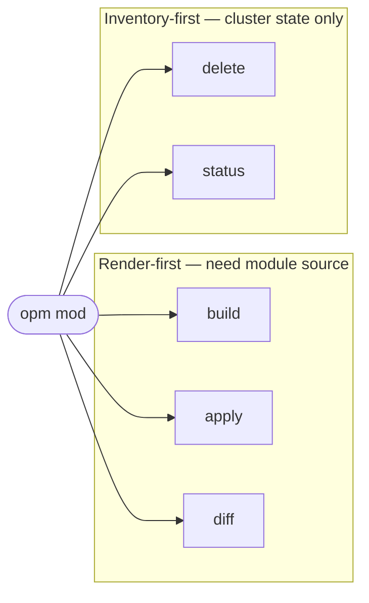
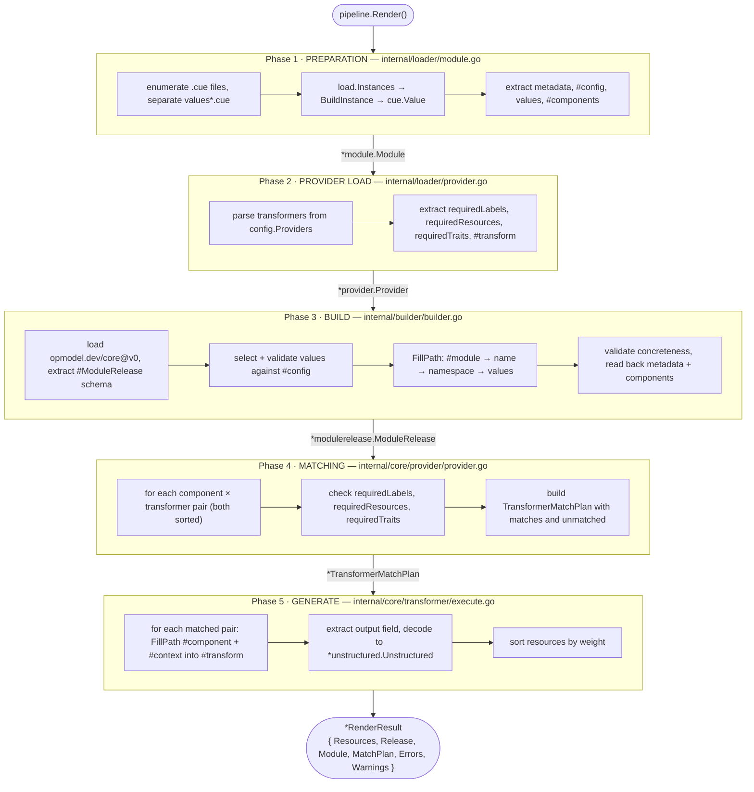
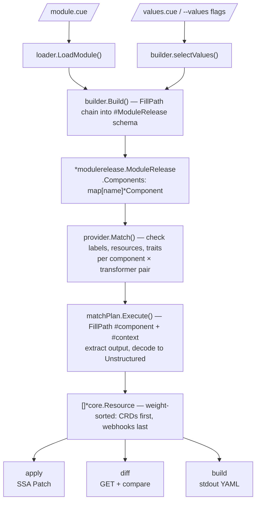
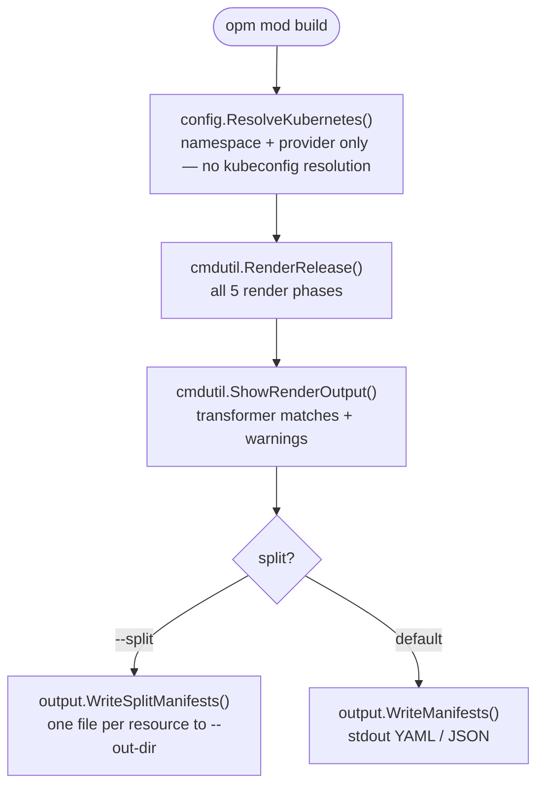
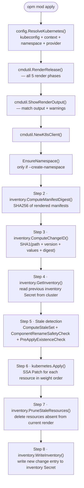
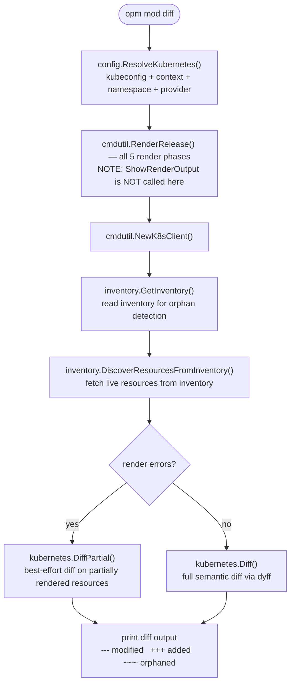
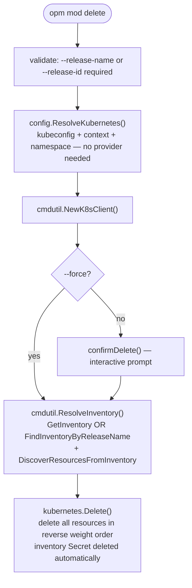
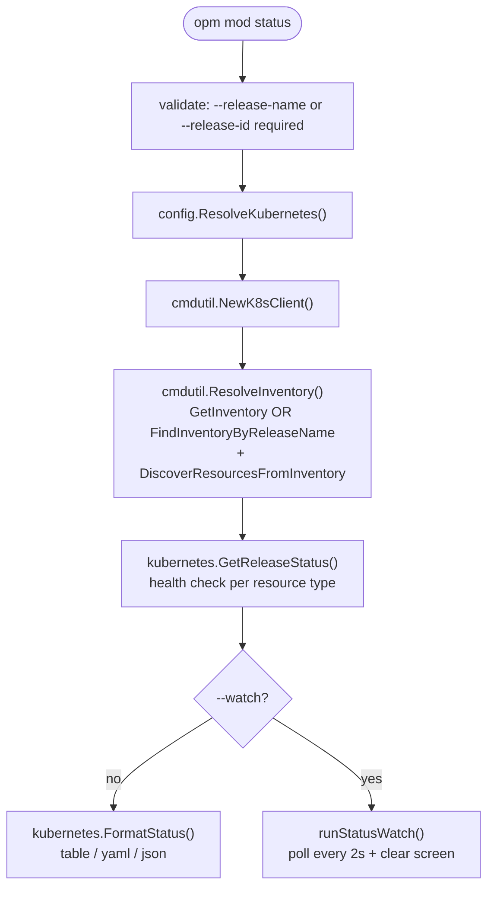
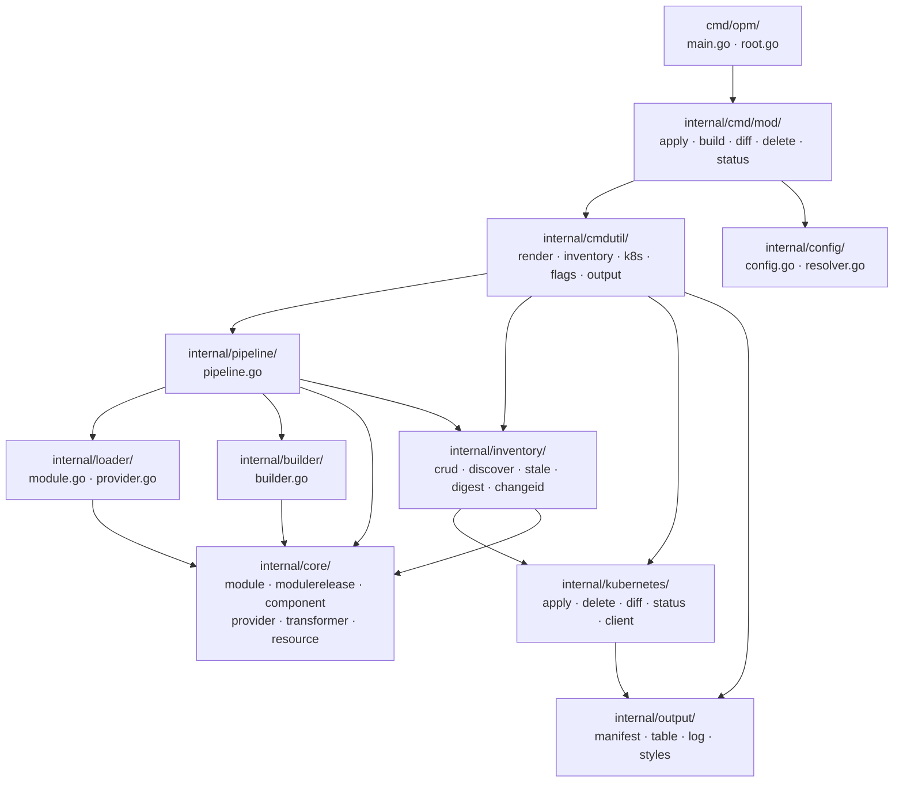

# OPM Mod Pipeline — Architecture Reference

> **Scope**: `opm mod apply`, `build`, `diff`, `delete`, `status`
> **Last updated**: 2026-02-23

---

## Overview

The five `opm mod` commands split into two fundamentally different shapes:

Render-first commands read local `.cue` files and produce Kubernetes resources.
Inventory-first commands only consult the inventory Secret already on the cluster.

---

## The Render Pipeline (shared core)

Every render-first command runs through the same 5-phase pipeline implemented in
`internal/pipeline/pipeline.go`. The pipeline is invoked via the thin shared
wrapper `cmdutil.RenderRelease()` (`internal/cmdutil/render.go`).

---

## Key Data Flow: CUE to Kubernetes

---

## Per-Command Pipelines

### `opm mod build`

The simplest path — render only, no cluster contact.

| | |
|---|---|
| **Packages** | `config`, `cmdutil`, `pipeline`, `loader`, `builder`, `core/*`, `output` |
| **Cluster** | not contacted |

---

### `opm mod apply`

The most complex path — render + 8-step inventory-aware cluster apply.

| | |
|---|---|
| **Packages** | `config`, `cmdutil`, `pipeline`, `loader`, `builder`, `core/*`, `inventory`, `kubernetes`, `output` |
| **Cluster** | connected — read + write |

---

### `opm mod diff`

Render + semantic cluster comparison — no writes.

| | |
|---|---|
| **Packages** | `config`, `cmdutil`, `pipeline`, `loader`, `builder`, `core/*`, `inventory`, `kubernetes`, `output` |
| **Cluster** | connected — read only |

---

### `opm mod delete`

Inventory-first — no render pipeline involved.

| | |
|---|---|
| **Packages** | `config`, `cmdutil`, `inventory`, `kubernetes`, `output` |
| **Cluster** | connected — read + write |
| **Pipeline** | not used — no module source needed |

---

### `opm mod status`

Inventory-first — no render pipeline involved.

| | |
|---|---|
| **Packages** | `config`, `cmdutil`, `inventory`, `kubernetes`, `output` |
| **Cluster** | connected — read only |
| **Pipeline** | not used — no module source needed |

---

## Shared Infrastructure

The following utilities are reused across commands without duplication.

| Utility | Used by | What it does |
|---|---|---|
| `config.ResolveKubernetes()` `internal/config/resolver.go` | all five commands | Resolve kubeconfig / context / namespace / provider via precedence: flag > env > config > default |
| `cmdutil.RenderRelease()` `internal/cmdutil/render.go` | build, apply, diff | Thin wrapper: resolve module path, build RenderOptions, call pipeline.Render, handle fatal errors |
| `cmdutil.ShowRenderOutput()` `internal/cmdutil/render.go` | build, apply (not diff) | Check render errors, print transformer match log, emit warnings |
| `cmdutil.NewK8sClient()` `internal/cmdutil/k8s.go` | apply, diff, delete, status | Create Kubernetes dynamic client from pre-resolved kubeconfig + context |
| `cmdutil.ResolveInventory()` `internal/cmdutil/inventory.go` | delete, status | Lookup inventory by name or id, discover live resources from it |
| `cmdutil.RenderFlags` `internal/cmdutil/flags.go` | build, apply, diff | `-f/--values`, `-n/--namespace`, `--provider`, `--release-name` |
| `cmdutil.K8sFlags` `internal/cmdutil/flags.go` | apply, diff, delete, status | `--kubeconfig`, `--context` |
| `cmdutil.ReleaseSelectorFlags` `internal/cmdutil/flags.go` | delete, status | `--release-name`, `--release-id`, `--namespace` |

---

## Package Dependency Map

---

## Notable Design Decisions

**`diff` skips `ShowRenderOutput`**

`apply` and `build` call `cmdutil.ShowRenderOutput()` which returns an error
(and stops) if the render has errors. `diff` intentionally does not — it calls
`kubernetes.DiffPartial()` instead to show a best-effort diff for the resources
that did render successfully, even when some components failed. The comment in
`diff.go:77-78` documents this explicitly.

**Single CUE context per command**

The same `*cue.Context` flows from `config.GlobalConfig.CueContext` into
`pipeline.NewPipeline()`, through `loader.LoadModule()`, `builder.Build()`, and
into `matchPlan.Execute()`. All CUE values (`mod.Raw`, `releaseSchema`,
`transformValue`, etc.) are bound to this context — mixing contexts causes a
runtime panic. This is why the config creates one fresh context per command
invocation (not a global singleton).

**Execute is sequential, not concurrent**

`matchPlan.Execute()` runs transformer matches one at a time. `*cue.Context` is
not safe for concurrent use, so parallelism is not possible here without
multiple contexts. The match plan iteration order is deterministic (components
and transformers are sorted alphabetically before matching).

**Inventory is the source of truth for cluster-side commands**

`delete` and `status` never read the module source. They recover all needed
information from the inventory Secret stored on the cluster. This means a
release can be deleted or inspected even after the module source is gone or
unavailable.

**Stale detection is manifest-only, not cluster-based**

The stale set is computed by diffing the previous inventory entries against the
current render output — no cluster GET is required for this step. This makes
stale detection fast and offline, but it requires the inventory to stay
consistent with what's actually on the cluster.

**Values isolation**

`values.cue` is loaded separately via `ctx.CompileBytes` and never unified into
`mod.Raw`. This keeps the default module definition clean. Extra `values_*.cue`
files in the module directory are silently excluded from the package load and
reported via DEBUG — they must be passed explicitly via `--values` to take
effect.
