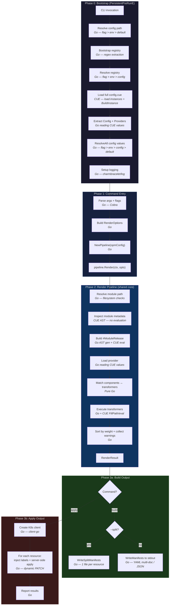
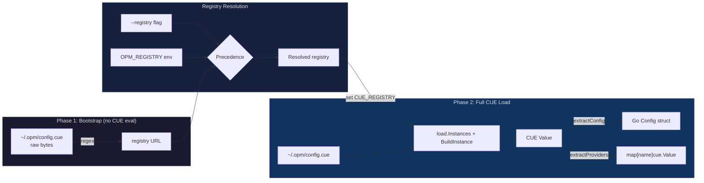
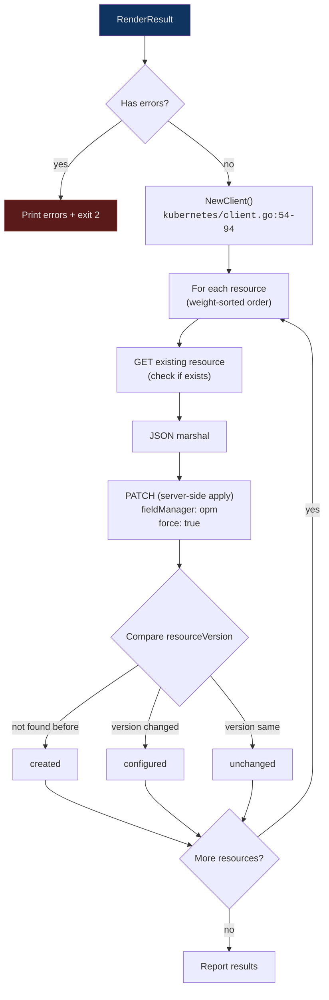

# Render Pipeline Design

> Design document for the `opm mod build` and `opm mod apply` render pipeline.
> Covers the complete execution flow from CLI invocation through config bootstrap,
> CUE module loading, component-transformer matching, and output/apply.

## 1. Overview

Both `opm mod build` and `opm mod apply` share a single **render pipeline**
(`build.Pipeline.Render`). The pipeline loads a CUE module, builds a concrete
release, matches components to provider transformers, executes those transformers
to produce Kubernetes resources, and returns a `RenderResult`.

The commands diverge only at the output stage:

- **`build`** writes rendered manifests to stdout or split files.
- **`apply`** sends rendered resources to a Kubernetes cluster via server-side apply.

### Key Packages

| Package | Role |
|---------|------|
| `internal/cmd` | Cobra command definitions, flag handling, entry points |
| `internal/config` | Two-phase config loading, precedence resolution |
| `internal/build` | Render pipeline: release building, matching, execution |
| `internal/kubernetes` | K8s client, server-side apply, label injection |
| `internal/output` | Manifest serialization, verbose output, logging |
| `pkg/weights` | Resource ordering weights for apply order |

## 2. Pipeline Overview



## 3. Phase 0: Bootstrap

Before any subcommand runs, the root command's `PersistentPreRunE` fires
(`internal/cmd/root.go:36-37`). This loads configuration and resolves all
settings.

### 3.1 Two-Phase Config Loading

Config loading uses a two-phase approach because CUE needs the registry URL to
resolve imports, but the registry URL may be defined inside the config file
itself.



**`LoadOPMConfig()`** — `internal/config/loader.go:69-131`:

| Step | Engine | Description |
|------|--------|-------------|
| 1. Resolve config path | **Go** | `ResolveConfigPath()` — flag > `OPM_CONFIG` env > `~/.opm/config.cue` |
| 2. Bootstrap registry | **Go (regex)** | `BootstrapRegistry()` reads config as bytes, extracts `registry: "..."` via regex. No CUE evaluation. |
| 3. Resolve registry | **Go** | `ResolveRegistry()` — flag > env > config value |
| 4. Fail-fast check | **Go** | If providers configured but no registry resolvable, error immediately |
| 5. Full config load | **CUE** | `loadFullConfig()` sets `CUE_REGISTRY`, calls `load.Instances` + `ctx.BuildInstance` |
| 6. Extract config | **Go** | `extractConfig()` walks CUE value via `LookupPath` to populate `Config` struct |
| 7. Extract providers | **Go** | `extractProviders()` iterates `config.providers` field, stores each as `cue.Value` |

**Result:** `OPMConfig` containing the Go config struct, resolved registry, provider CUE values, and a shared `*cue.Context`.

### 3.2 Configuration Resolution

**`ResolveAll()`** — `internal/config/resolver.go:180-259`:

Every config field is resolved using **Flag > Env > Config > Default** precedence.
Each resolved field tracks its source and any shadowed values (for `--verbose` output).

| Field | Env var | Default |
|-------|---------|---------|
| `kubeconfig` | `OPM_KUBECONFIG` | `~/.kube/config` |
| `context` | `OPM_CONTEXT` | _(current-context)_ |
| `namespace` | `OPM_NAMESPACE` | `default` |
| `registry` | `OPM_REGISTRY` | _(none)_ |
| `provider` | _(none)_ | Auto-resolve if exactly 1 configured |

Provider auto-resolution (`resolver.go:311-334`): if exactly one provider is in
the config, it is selected automatically without requiring a `--provider` flag.

## 4. Phase 1: Command Entry

### 4.1 `opm mod build` — `internal/cmd/mod_build.go:104-213`

1. Determine module path (default: `.`)
2. Validate output format (`yaml` / `json`)
3. Get pre-loaded `opmConfig` from package-level var
4. Build `RenderOptions` — `build.RenderOptions{ModulePath, Values, Name, Namespace, Provider, Registry}`
5. Validate options (`RenderOptions.Validate()`)
6. Create pipeline — `build.NewPipeline(opmConfig)`
7. Call `pipeline.Render(ctx, opts)` — enters the shared render core
8. Handle verbose output (`--verbose`)
9. Check for render errors (unmatched components, transform failures)
10. Output results: split to files or write to stdout

### 4.2 `opm mod apply` — `internal/cmd/mod_apply.go:84-211`

1. Determine module path (default: `.`)
2. Resolve flags with global fallback — `resolveFlag(localFlag, globalResolved)`
3. Get pre-loaded `opmConfig`
4. Build `RenderOptions` (same struct as build)
5. Validate options
6. Create pipeline — `build.NewPipeline(opmConfig)`
7. Call `pipeline.Render(ctx, opts)` — same shared render core
8. Check for render errors
9. Create K8s client — `kubernetes.NewClient()`
10. Apply resources — `kubernetes.Apply()`
11. Report results

### 4.3 Pipeline Construction — `internal/build/pipeline.go:32-39`

`NewPipeline(cfg)` instantiates four sub-components:

| Component | Type | Role |
|-----------|------|------|
| `releaseBuilder` | `*ReleaseBuilder` | Builds concrete releases from CUE modules |
| `provider` | `*ProviderLoader` | Loads provider transformer definitions |
| `matcher` | `*Matcher` | Matches components to transformers |
| `executor` | `*Executor` | Executes transformers to produce K8s resources |

All share the same `*cue.Context` from the config bootstrap.

## 5. Phase 2: Render Pipeline

This is the shared core invoked by both `build` and `apply`.

**`pipeline.Render()`** — `internal/build/pipeline.go:54-169`

```mermaid
flowchart TD
    START["pipeline.Render(ctx, opts)"] --> S1

    subgraph s1["Step 1: Resolve Module Path"]
        S1["resolveModulePath()<br/><code>pipeline.go:179-200</code>"]
        S1 --> S1a[Convert to absolute path]
        S1a --> S1b["Check dir exists"]
        S1b --> S1c["Check cue.mod/ exists"]
        S1c --> S1d["Check values.cue exists"]
    end

    S1d --> S2

    subgraph s2["Step 2: Inspect Module Metadata"]
        S2["InspectModule()<br/><code>release_builder.go:281-312</code>"]
        S2 --> S2a["load.Instances(['.' ]) — CUE parses to AST"]
        S2a --> S2b["Read inst.PkgName"]
        S2b --> S2c["Walk AST for metadata.name,<br/>metadata.defaultNamespace"]
        S2c --> S2d{"AST returned<br/>empty name?"}
        S2d -- yes --> S2e["Fallback: BuildInstance<br/>+ LookupPath (CUE eval)"]
        S2d -- no --> S2f["ModuleInspection"]
        S2e --> S2f
    end

    S2f --> S3

    subgraph s3["Step 3: Build Release"]
        S3["releaseBuilder.Build()<br/><code>release_builder.go:89-196</code>"]
        S3 --> S3a["Determine package name"]
        S3a --> S3b["generateOverlayAST() — Go AST<br/>adds #opmReleaseMeta definition"]
        S3b --> S3c["format.Node() — AST to CUE bytes"]
        S3c --> S3d["load.Instances with Overlay"]
        S3d --> S3e["ctx.BuildInstance — CUE evaluates<br/>module + overlay + imports"]
        S3e --> S3f["Unify --values files<br/>CompileBytes + Unify per file"]
        S3f --> S3g["FillPath('#config', values)<br/>makes components concrete"]
        S3g --> S3h["extractComponentsFromDefinition()<br/>reads #components"]
        S3h --> S3i["Validate(Concrete(true))<br/>per component"]
        S3i --> S3j["extractReleaseMetadata()<br/>from #opmReleaseMeta"]
        S3j --> S3k["BuiltRelease"]
    end

    S3k --> S4

    subgraph s4["Step 4: Load Provider"]
        S4["provider.Load()<br/><code>provider.go:47-107</code>"]
        S4 --> S4a["Lookup provider by name<br/>in config.Providers"]
        S4a --> S4b["Extract version string"]
        S4b --> S4c["Iterate transformers field"]
        S4c --> S4d["Per transformer: extract<br/>requiredLabels, requiredResources,<br/>requiredTraits, optionalTraits"]
        S4d --> S4e["LoadedProvider"]
    end

    S4e --> S5

    subgraph s5["Step 5: Match Components ↔ Transformers"]
        S5["matcher.Match()<br/><code>matcher.go:50-76</code>"]
        S5 --> S5a["For each (component, transformer):"]
        S5a --> S5b["Check requiredLabels<br/>all must match"]
        S5b --> S5c["Check requiredResources<br/>all FQNs must exist"]
        S5c --> S5d["Check requiredTraits<br/>all FQNs must exist"]
        S5d --> S5e["Track unhandled traits"]
        S5e --> S5f["MatchResult"]
    end

    S5f --> S6

    subgraph s6["Step 6: Execute Transformers"]
        S6["executor.ExecuteWithTransformers()<br/><code>executor.go:49-106</code>"]
        S6 --> S6a["Build job list from matches"]
        S6a --> S6b["For each job (sequential):"]
        S6b --> S6c["LookupPath('#transform')"]
        S6c --> S6d["FillPath('#component', comp.Value)"]
        S6d --> S6e["Build TransformerContext"]
        S6e --> S6f["FillPath('#context.*', encoded)"]
        S6f --> S6g["LookupPath('output') — CUE evaluates"]
        S6g --> S6h["Decode output → Unstructured"]
        S6h --> S6i["normalizeK8sResource()<br/>maps → arrays"]
    end

    S6i --> S7

    subgraph s7["Step 7: Build Result"]
        S7["Sort by weight<br/><code>pkg/weights</code>"]
        S7 --> S7a["Collect warnings<br/>(unhandled traits)"]
        S7a --> S7b["RenderResult"]
    end

    style s1 fill:#1a2a1a,stroke:#2d4a2d,color:#e0e0e0
    style s2 fill:#1a1a2e,stroke:#16213e,color:#e0e0e0
    style s3 fill:#2e1a2e,stroke:#3e1640,color:#e0e0e0
    style s4 fill:#1a1a2e,stroke:#16213e,color:#e0e0e0
    style s5 fill:#1a2a1a,stroke:#2d4a2d,color:#e0e0e0
    style s6 fill:#2e1a2e,stroke:#3e1640,color:#e0e0e0
    style s7 fill:#1a2a1a,stroke:#2d4a2d,color:#e0e0e0
```



### 5.1 Resolve Module Path — Go

**`resolveModulePath()`** — `internal/build/pipeline.go:179-200`

Pure Go filesystem validation:

1. Convert relative path to absolute via `filepath.Abs`
2. `os.Stat` to verify directory exists
3. Check `cue.mod/` subdirectory exists (confirms it is a CUE module)
4. Check `values.cue` exists (required by the OPM module contract)

Failure at any step is fatal — returns error immediately.

### 5.2 Inspect Module Metadata — CUE AST (no evaluation)

**`InspectModule()`** — `internal/build/release_builder.go:281-312`

This step extracts module metadata **without CUE evaluation** for performance:

1. Sets `CUE_REGISTRY` env var (needed for modules with registry imports)
2. `load.Instances(["."]) ` — CUE parses all `.cue` files in the module directory
   into AST trees. This resolves imports but does **not** evaluate expressions.
3. Reads `inst.PkgName` — the CUE package name (e.g., `jellyfin`)
4. `extractMetadataFromAST(inst.Files)` — walks the AST looking for:
   - `metadata.name` as a string literal
   - `metadata.defaultNamespace` as a string literal

   Only static string literals are extracted. Computed expressions (e.g.,
   `name: #config.name`) return empty and trigger the fallback.

**Fallback path** (`pipeline.go:77-83`): If AST inspection returns an empty
name, `extractModuleMetadata()` does a lightweight CUE `BuildInstance` +
`LookupPath` to extract metadata through full CUE evaluation.

### 5.3 Build Release — Go AST Generation + CUE Evaluation

**`releaseBuilder.Build()`** — `internal/build/release_builder.go:89-196`

This is the most CUE-intensive step. It produces a `BuiltRelease` with fully
concrete components.

#### a) Determine Package Name

Uses `opts.PkgName` from the inspection step. Falls back to
`detectPackageName()` (`release_builder.go:258-272`) which does a minimal
`load.Instances` call.

#### b) Generate Overlay AST — Go

**`generateOverlayAST()`** — `release_builder.go:386-479`

Builds a synthetic CUE file as a **typed Go AST** (not string interpolation).
The overlay defines `#opmReleaseMeta` which computes:

- **Release identity**: `uuid.SHA1(opmNamespaceUUID, "\(fqn):\(name):\(namespace)")` — a deterministic UUID v5
- **Standard release labels**: `module-release.opmodel.dev/name`, `module-release.opmodel.dev/version`, `module-release.opmodel.dev/uuid`
- **Merged labels**: `metadata.labels & { standard labels }`

The overlay references the module's own `metadata.fqn` and `metadata.version`
fields, allowing CUE to resolve them during evaluation.

`format.Node()` serializes the AST to CUE source bytes.

#### c) Load Module with Overlay — CUE

`load.Instances(["."]) ` with the overlay mapped in `load.Config.Overlay`.
CUE sees the overlay as a file in the module directory. `ctx.BuildInstance(inst)`
evaluates the entire module — including all imports from the registry.

#### d) Unify Values Files — CUE

For each `--values` / `-f` file:
1. `ctx.CompileBytes(content)` — compile the values file
2. `value.Unify(valuesValue)` — merge into the module value

#### e) Inject Values into `#config` — CUE

```go
concreteModule := value.FillPath(cue.ParsePath("#config"), values)
```

This makes the abstract `#config` definition concrete with user-provided values.
Components that reference `#config` fields become fully concrete.

#### f) Extract Components — Go Reading CUE

**`extractComponentsFromDefinition()`** — `release_builder.go:506-528`

Looks up `#components` in the concrete module, iterates its fields, and for each
component extracts:

| Field | CUE Path | Go Type |
|-------|----------|---------|
| Name | `metadata.name` | `string` |
| Labels | `metadata.labels` | `map[string]string` |
| Annotations | `metadata.annotations` | `map[string]string` |
| Resources | `#resources` | `map[string]cue.Value` (FQN keyed) |
| Traits | `#traits` | `map[string]cue.Value` (FQN keyed) |
| Value | _(entire component)_ | `cue.Value` |

#### g) Validate Concreteness — CUE

```go
comp.Value.Validate(cue.Concrete(true))
```

CUE checks that no abstract or incomplete values remain. If any component has
unresolved fields, a `ReleaseValidationError` is returned.

#### h) Extract Release Metadata — Go Reading CUE

**`extractReleaseMetadata()`** — `release_builder.go:628-683`

Reads from the overlay-computed `#opmReleaseMeta`:

- `version` — module semver
- `fqn` — fully qualified module name
- `identity` — release UUID (computed by CUE `uuid.SHA1`)
- `labels` — merged module + release labels

Also extracts `metadata.identity` (module identity UUID) directly from the module.

### 5.4 Load Provider — Go Reading CUE Values

**`ProviderLoader.Load()`** — `internal/build/provider.go:47-107`

Providers are CUE values pre-loaded during config bootstrap (Phase 0). This step
extracts transformer metadata:

1. Look up provider by name in `config.Providers` map
2. Extract `version` string
3. Iterate `transformers` struct field
4. For each transformer — `extractTransformer()` (`provider.go:112-146`):

| Field | CUE Path | Purpose |
|-------|----------|---------|
| `requiredLabels` | `requiredLabels` | Component must have these label key-value pairs |
| `requiredResources` | `requiredResources` | Component must have these resource FQNs |
| `requiredTraits` | `requiredTraits` | Component must have these trait FQNs |
| `optionalLabels` | `optionalLabels` | Recognized but not required |
| `optionalResources` | `optionalResources` | Recognized but not required |
| `optionalTraits` | `optionalTraits` | Recognized but not required |
| `Value` | _(entire transformer)_ | Full CUE value for execution |

The FQN is built as `providerName#transformerName` (`provider.go:212-214`).

### 5.5 Match Components to Transformers — Pure Go

**`Matcher.Match()`** — `internal/build/matcher.go:50-76`

This is pure Go set-intersection logic. No CUE evaluation.

For every `(component, transformer)` pair:

1. **Required labels** — all transformer `requiredLabels` must exist in the
   component with matching values
2. **Required resources** — all FQNs in `requiredResources` must exist in
   the component's `#resources` map
3. **Required traits** — all FQNs in `requiredTraits` must exist in the
   component's `#traits` map
4. **Unhandled traits** — traits present on the component but not in the
   transformer's required or optional lists

Key rules:
- Multiple transformers **can** match one component (e.g., both
  `DeploymentTransformer` and `ServiceTransformer` match the same component)
- Zero matches marks the component as **unmatched** (becomes a render error)
- A trait is "truly unhandled" only if **all** matched transformers for that
  component consider it unhandled (`pipeline.go:299-341`)

### 5.6 Execute Transformers — Go + CUE

**`Executor.ExecuteWithTransformers()`** — `internal/build/executor.go:49-106`

Transformers are executed **sequentially** because CUE's `*cue.Context` is not
safe for concurrent use.

For each `(transformer, component)` job — `executeJob()` (`executor.go:112-239`):

| Step | Engine | What happens |
|------|--------|-------------|
| 1. Look up `#transform` | CUE | `transformer.Value.LookupPath("#transform")` |
| 2. Inject `#component` | CUE | `transformValue.FillPath("#component", comp.Value)` |
| 3. Build context | Go | `NewTransformerContext(release, component)` constructs metadata |
| 4. Inject `#context` | CUE | Multiple `FillPath` calls for name, namespace, moduleReleaseMetadata, componentMetadata |
| 5. Extract output | CUE | `unified.LookupPath("output")` — CUE evaluates the `#transform` function |
| 6. Decode resources | Go | `value.Decode(&obj)` into `map[string]any` |
| 7. Normalize | Go | `normalizeK8sResource()` converts OPM maps to K8s arrays |

#### TransformerContext Structure

Built by `NewTransformerContext()` (`internal/build/context.go:40-58`):

```
#context: {
    name:      "release-name"
    namespace: "target-namespace"
    #moduleReleaseMetadata: {
        name, namespace, fqn, version, identity, labels
    }
    #componentMetadata: {
        name, labels, annotations
    }
}
```

#### Output Decoding

The executor handles three output shapes (`executor.go:200-236`):

1. **List** — iterate elements, decode each as a K8s resource
2. **Struct with `apiVersion`** — single resource (e.g., a Deployment)
3. **Struct without `apiVersion`** — map of resources keyed by name (e.g., one PVC per volume)

#### OPM-to-K8s Normalization

**`normalizeK8sResource()`** — `executor.go:260-307`

OPM modules define container ports, env vars, and volumes as maps for
ergonomics. Kubernetes requires arrays. The normalizer converts:

| OPM (map) | K8s (array) |
|-----------|-------------|
| `container.ports` | `[]containerPort` (sorted by key, key becomes `name`) |
| `container.env` | `[]envVar` (sorted by key) |
| `container.volumeMounts` | `[]volumeMount` (sorted by key) |
| `spec.volumes` / `template.spec.volumes` | `[]volume` (sorted by key) |
| Annotation bool/numeric values | Coerced to strings |

This normalization handles Deployment, StatefulSet, DaemonSet, Job, and CronJob
resource structures.

### 5.7 Build Result — Go

**`pipeline.Render()`** — `internal/build/pipeline.go:151-169`

1. **Sort resources by weight** — uses `pkg/weights.GetWeight()` which maps
   `GroupVersionKind` to integer weights:

   | Weight | Resources |
   |--------|-----------|
   | -100 | CRDs |
   | 0 | Namespaces |
   | 5-10 | RBAC (ClusterRole, ServiceAccount, Role) |
   | 15 | Secrets, ConfigMaps |
   | 20 | Storage (PV, PVC, StorageClass) |
   | 50 | Services |
   | 100 | Workloads (Deployment, StatefulSet, DaemonSet) |
   | 110 | Jobs, CronJobs |
   | 150 | Ingress, NetworkPolicy |
   | 200 | HPA, VPA, PDB |
   | 500 | Webhooks |
   | 1000 | Unknown resources |

2. **Collect warnings** — unhandled traits are collected as warnings.

3. **Return `RenderResult`** containing:
   - `Resources` — weight-sorted `[]*Resource` with `Unstructured` objects
   - `Module` — `ModuleMetadata` (name, namespace, version, labels, identity)
   - `MatchPlan` — per-component transformer matches (for `--verbose`)
   - `Errors` — unmatched components, transform failures
   - `Warnings` — unhandled traits

## 6. Phase 3a: Build Output — Go

**`runBuild()`** — `internal/cmd/mod_build.go:160-210`

### Verbose Output

If `--verbose` is set, `WriteVerboseMatchLog()` writes matching details to
stderr (`internal/cmdutil/output.go`):

- Module metadata (name, namespace, version, components)
- Per-component transformer matches with reasons
- Unmatched components
- Generated resources (kind, name, namespace, source component)

### Manifest Output

Resources are converted to `output.ResourceInfo` interface and written via:

- **`WriteManifests()`** (`internal/output/manifest.go:39-56`) — YAML multi-doc
  (separated by `---`) or JSON array to stdout. Resources are re-sorted by
  weight for deterministic output.

- **`WriteSplitManifests()`** (`internal/output/split.go:20-49`) — one file per
  resource, named `<kind>-<name>.yaml`, written to `--out-dir` (default
  `./manifests`). Handles filename collisions with numeric suffixes.

## 7. Phase 3b: Apply Output — Go + Kubernetes



### 7.1 Kubernetes Client Creation

**`NewClient()`** — `internal/kubernetes/client.go:54-94`

The client is a cached singleton per CLI invocation. It creates:

- `rest.Config` via `clientcmd` with kubeconfig resolution
  (flag > `OPM_KUBECONFIG` > `KUBECONFIG` > `~/.kube/config`)
- `dynamic.Interface` for server-side apply operations
- `kubernetes.Interface` for discovery and API group listing
- Custom warning handler based on config (`warn` / `debug` / `suppress`)

### 7.2 Label Injection

OPM labels are now injected by CUE transformers during the render pipeline
(Phase 5), not at apply time. This means labels are part of the rendered output
and included in digest computation.

The transformers inject the following labels:

| Label | Value | Purpose |
|-------|-------|---------|
| `app.kubernetes.io/managed-by` | `open-platform-model` | Standard K8s managed-by label |
| `module.opmodel.dev/name` | Module name | Module identification |
| `module.opmodel.dev/version` | Module version | Version tracking |
| `component.opmodel.dev/name` | Component name | Component identification |
| `module.opmodel.dev/uuid` | Module identity UUID | Stable identity |
| `module-release.opmodel.dev/name` | Release name | Release identification |
| `module-release.opmodel.dev/version` | Release version | Release version tracking |
| `module-release.opmodel.dev/uuid` | Release identity UUID | Stable release identity |

These labels are used by `opm mod delete` and `opm mod status` for resource
discovery. Namespace scoping is handled by the Kubernetes API (namespaced
list calls), not by a label.

### 7.3 Server-Side Apply

**`applyResource()`** — `internal/kubernetes/apply.go:121-178`

1. Derive `GroupVersionResource` from the object's GVK using a known-kinds
   lookup table (`apply.go:192-230`) with heuristic pluralization fallback
2. GET existing resource to capture current `resourceVersion`
3. JSON marshal the resource
4. PATCH with `types.ApplyPatchType` (server-side apply), field manager `opm`,
   `force: true`
5. Determine status:
   - `created` — resource did not exist before
   - `configured` — resource existed and `resourceVersion` changed
   - `unchanged` — resource existed and `resourceVersion` is the same

Dry-run mode adds `DryRunAll` to the `PatchOptions`, causing the API server to
validate without persisting.

## 8. Go vs CUE Responsibility Summary

| Step | Engine | Description | File |
|------|--------|-------------|------|
| Config path/registry resolution | **Go** | Precedence logic, env vars, regex bootstrap | `config/loader.go`, `config/resolver.go` |
| Config loading (Phase 2) | **CUE** | `load.Instances` + `BuildInstance` on config.cue | `config/loader.go:152-220` |
| Config value extraction | **Go** | `LookupPath` to populate Go structs | `config/loader.go:224-322` |
| Module path validation | **Go** | Filesystem checks | `build/pipeline.go:179-200` |
| AST metadata inspection | **CUE AST** | `load.Instances` + AST walk, no evaluation | `build/release_builder.go:281-371` |
| Overlay generation | **Go** | Typed AST construction via `ast.*` | `build/release_builder.go:386-479` |
| Module loading + overlay | **CUE** | `load.Instances` + `BuildInstance` with overlay | `build/release_builder.go:121-142` |
| Values unification | **CUE** | `CompileBytes` + `Unify` | `build/release_builder.go:145-154` |
| `#config` injection | **CUE** | `FillPath` | `build/release_builder.go:157-170` |
| Component extraction | **Go** | `LookupPath` + field iteration over CUE values | `build/release_builder.go:506-590` |
| Concreteness validation | **CUE** | `Validate(Concrete(true))` | `build/release_builder.go:179-186` |
| Provider transformer extraction | **Go** | `LookupPath` + field iteration over CUE values | `build/provider.go:47-189` |
| Component-transformer matching | **Go** | Label/resource/trait set intersection | `build/matcher.go:50-182` |
| Transformer execution | **CUE** | `FillPath` for injection, CUE evaluates `#transform` | `build/executor.go:112-239` |
| Output decoding | **Go** | `Decode` CUE to Go maps, normalize to K8s arrays | `build/executor.go:248-443` |
| Weight sorting | **Go** | Static weight table lookup | `pkg/weights/weights.go` |
| Manifest output | **Go** | YAML/JSON encoding | `output/manifest.go`, `output/split.go` |
| K8s server-side apply | **Go** | `client-go` dynamic client PATCH | `kubernetes/apply.go` |
